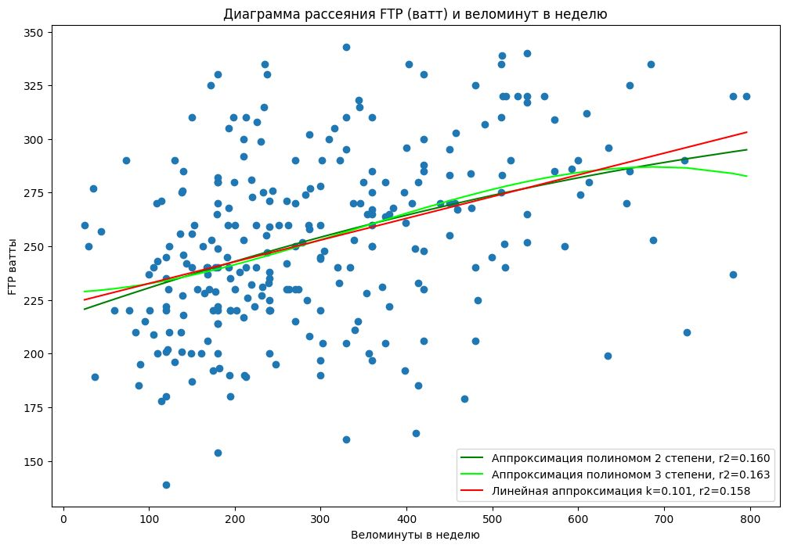
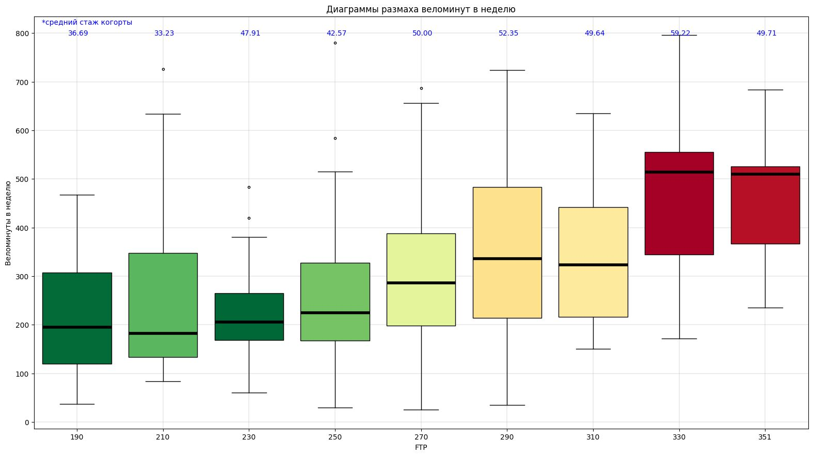
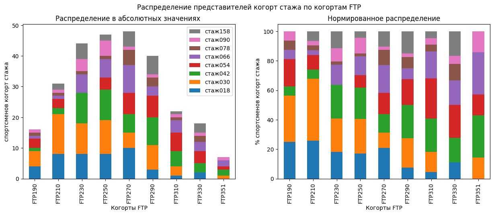

# Исследование связи FTP и длительности тренировок велосипедистов и триатлетов

Это исследование взаимосвязи функциональной мощности и длительности тренировок велосипедистов и триатлетов. Анализ проведен по данным опроса спортсменов, который проводился в телеграмм-канале [Тренер Сурен](https://t.me/surencoach/1082) основателя онлайн-платформы для подготовки к стартам по триатлону и велоспорту Trisystems Сурена Арутюняна. Всего в опросе приняло участие более 300 спортсменов. Требовалось обнаружить и описать взаимосвязи объема тренировок с мощностью, а также возможные связи с другими параметрами тренировок и спортсменов.

Данные формы опроса проходят ручную предобработку. Явные аномалии, где это возможно, корректируются. Ответы с пустыми ключевыми для исследования колонками - удаляются. Данные для расчета экспортируются в неудобном для анализа формате, поэтому требуется предобработка данных.

Ход исследования:
- Загрузка данных
- Предобработка данных
- Исследовательский анализ данных
- Определение корреляции числовых показателей
- Определение взаимосвязи FTP и веломинут
- Когортный анализ данных по FTP, веломинутам и стажу
- Изучение аномалий взаимосвязи роста FTP с ростом веломинут
- Сравнение тренировок велосипедистов и триатлетов
- Сравнение способов определения FTP

**Полученные выводы:**

- Между FTP и длительностью велотренировок у велосипедистов и триатлетов в целом обнаруживается средняя положительная корреляция. Спортсмены, которые тренируются в неделю на один час больше, имеют и FTP в среднем на 6-7 ватт больше.

- Когортный анализ показывает взаимосвязь роста веломинут и FTP. Однако. когортный анализ дает понимание, что не прямая зависимость или строгий закон. Спортсмены с определенным объемом веломинут могут войти в разные когорты по FTP.

- Взаимосвязи с тренировочным стажем также обнаруживаются при когортной анализе. Она имеет нелинейный характер и показывает выход на максимальные значения FTP на 3-6 годы стажа, а также стабилизацию объема веломинут на уровне 200-400 минут.

- Взаимосвязь роста FTP и длительности тренировок - не монотонная. Вероятно, это связно с завышением некоторыми спортсменами длительности своих велотренировок. Возможно, это просто методическая ошибка.

- Сравнение спортсменов только с велотренировками и сочетающих их с другими активностями показало, что они имеют сопоставимые FTP. Однако при этом длительность велотренировок у "чистых" велосипедистов на треть большее. Скорее всего, спортсмены занимающиеся несколькими видами спорта дорабатывают свою форму тренировками по другим видам спорта. С учетом всех тренировок, перевес в длительности занятий уже у мультиспортивных атлетов, более чем в полтора раза.

- Сравнение способов определения FTP не показало статистически значимое различие между ними.

**Скриншоты**
|  |  |  |
| -- | -- | -- |
| |  |   |
