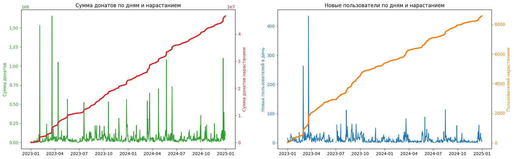

# Синдром любви

Задача стояла выявить ключевые тенденции, сегменты жертвователей и предложить рекомендации по улучшению маркетинговых стратегий фонда фонду “Синдром любви”. Для анализа предоставлена файлы выгрузки из Битрикс по полугодиям за 10 лет, более 200 колонок в каждом. Перед основным исследованием требовалось провести разведочный анализ для выявления колонок, по которым можно строить основной анализ. 

**Этапы исследования:**

- Общие и средние основные показатели и метрики.
- Динамика показателей. Есть ли факторы роста, патерны в привязке с календарю?
- Портрет пользователей. Гендер, география.
- Сегментация пользователей. Определние параметров, по которым можно провести сегметацию.
- Приток новых жертводателей. Сколько новых доноров приходит ежемесячно и откуда?
- RFM-анализ
- Когортный анализ

**Скриншоты**

| График донатов и транзакций | Когортный анализ    |
| -- | --- | 
|  | |
| LTV в месяц    | Динамика донатов по сегментам пользователей  |
| |  | 

В рамках реализации данного проекта также был построение дашборд на Power BI. Для построения дашборда был написан отдельный ETL-скрипт на Python, который берет данные из исходных файлов, проводит их предобработку, а затем с через SQL запросы загружает в  базу данных. Дашборд на Power BI оперирует данными уже из БД PostgreSQL. Также в скрипте экстрактора с помощью запросов SQL из  основных таблиц (транзакций, пользователей и компаний) реализовано построены витрины RFM и когортного анализа, визуализация которые представлена на отдельной странице дашборда.

**Скриншоты**

| Основные показатели | Портрет пользователей    |Когортный и RFM анализ    |
| -- | --- | --- | 
|  | | |
