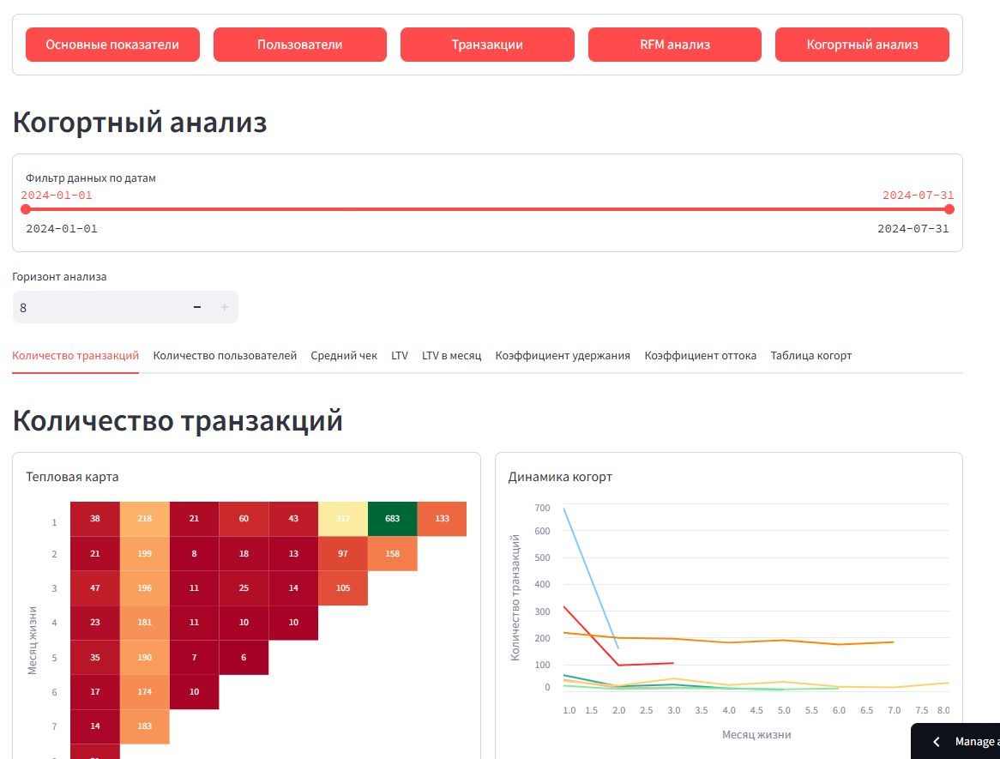
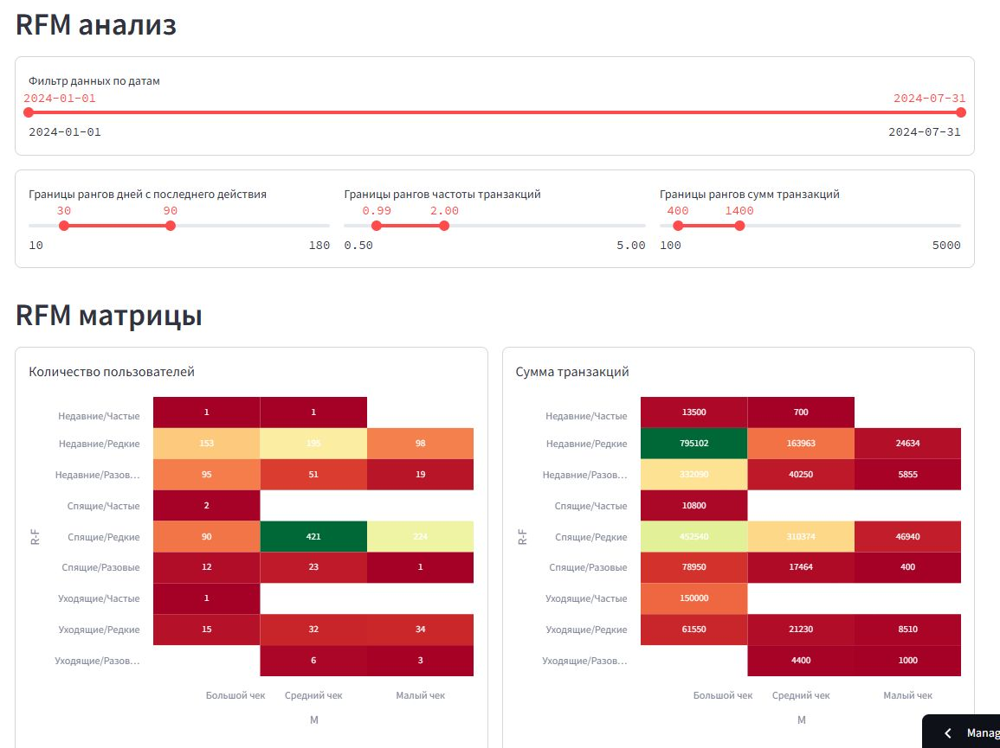
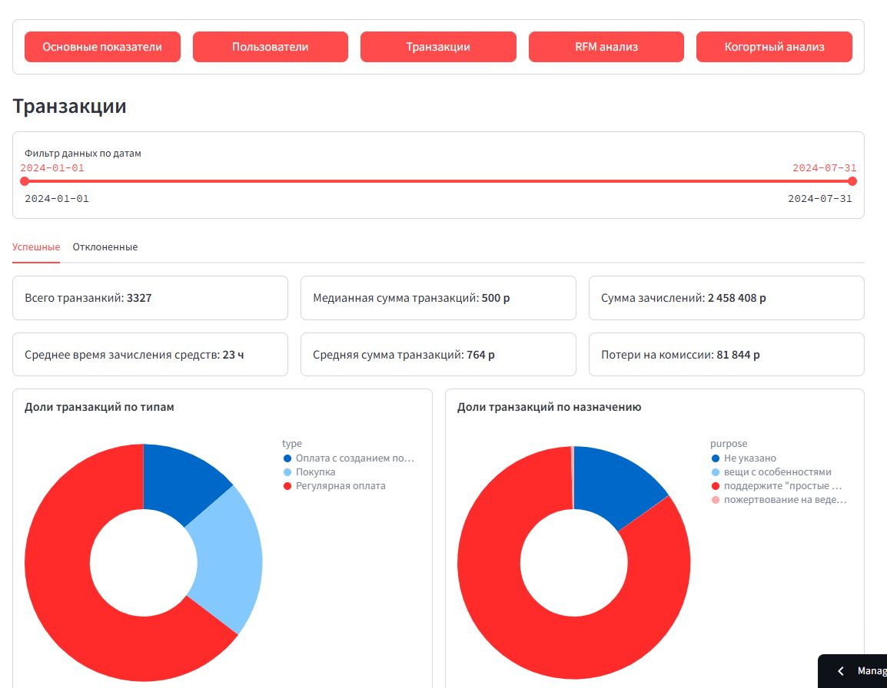

## Разработка аналитической панели для инклюзивных мастерских «Простые вещи»

**Задача:** инклюзивные мастерские «Простые вещи» — это мастерские (столярная, швейная, керамическая,дизайн-бюро, кулинарная, арт-студия, цветочная), в которых трудятся взрослые люди с ментальными особенностями. АНО «Простые вещи» хотят усовершенствовать фандрайзинг организации – лучше понимать лояльную аудиторию, кто покупает продукцию мастерских, кто оставляет пожертвования, понять, как лучше выстраивать коммуникацию с этими целевыми аудиториями. Целью работы является разработка аналитической панели (dashboard), которая будет содержать информацию о поведении пользователей и их лояльности к простым вещам. 

**Тетрадь Jupiter:** опробование / тестирование / отработка основных операций и процедур: загрузка данных, предобработка, исследовательский анализ, RFM и когортный анализ. Наиболее удачные решения затем были перенесены в дашборд.

Скрипты аналитической панели в папке [**streamlit**](streamlit/) 

Бонус:
[Аналитическая панель на **DataLens**](https://datalens.yandex/z01wcggxq33el) с использованием **только SQL запросов** к базе PostgreSQL с преобработанным данными по транзакциям. Примеры запросов в файле SQL.txt

**Скриншоты**

| Когортный анализ | RFM анализ    | Транзакции    |
| -- | --- | --- |
|  | | | 
