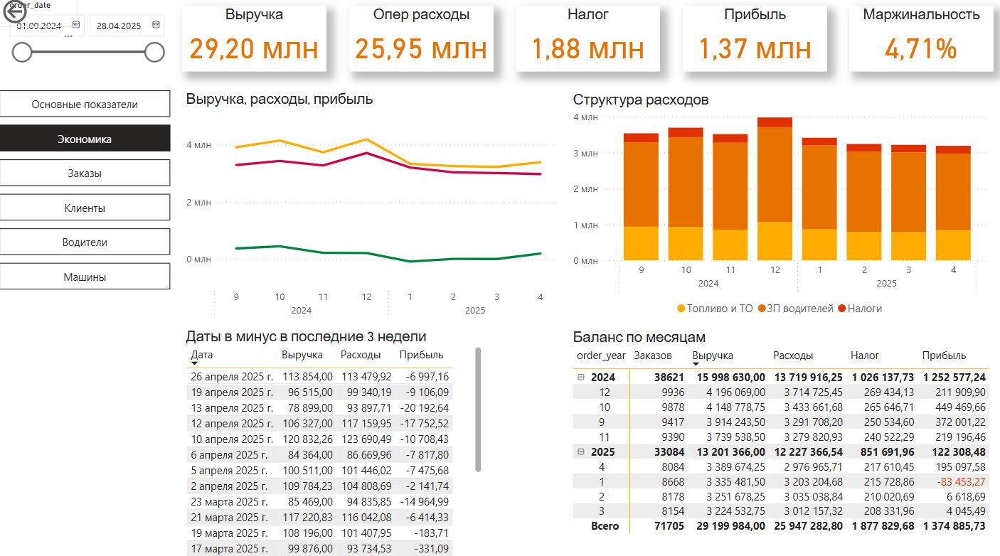

## Экстрактор данных и дашборд для сервиса такси

Сервис такси работает в небольшом городе на основе системы «Такси Мастер». Основные клиенты — сотрудники местных фирм, которых надо развозить на работу и по домам. С сервисом такси заключены договора — у каждого свои условия. Также такси принимает обычные заказы через сайт и телефон. Задача стояла так: вывести агрегированные данные из системы такси на дашборд или в Excel-файл, чтоб лучше понимать экономику, основные показатели, оценивать клиентскую базу, загруженность водителей и автопарка.

Для решения задачи я написал скрипт на Python, который реализует ETL-процесс получения данных о текущей работе сервиса такси. Данные импортируются по API, затем происходит небольшая предобработка. Преобразованные данные выгружаются в базу данных PostgreSQL. Уже в базе данных происходит их агрегирование и обновление витрин.

Для отображения показателей работы сервиса такси на основе базы данных PostgreSQL я создал дашборд на PowerBI. Также в экстракторе реализована выгрузка исходных данных в Excel-файл. Дальнейшее агрегирование необходимых показателей происходит уже посредством формул и сводных таблиц Excel.

**Скриншоты**

| Экстрактор | Дашборд   | Excel    |
| -- | --- | --- |
|  | | | 
 